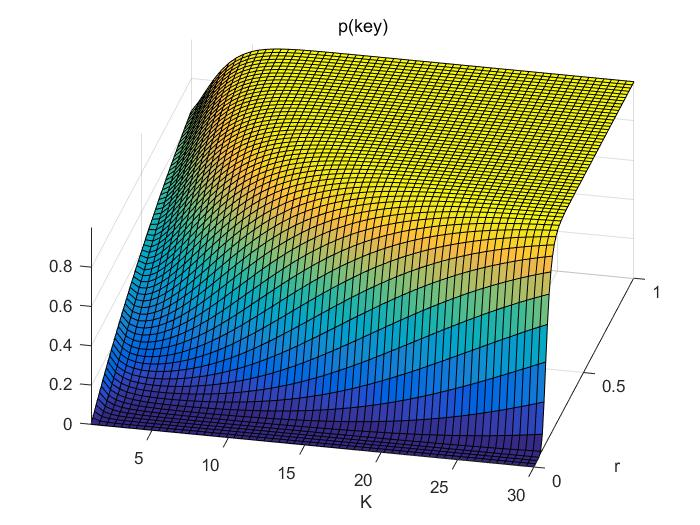
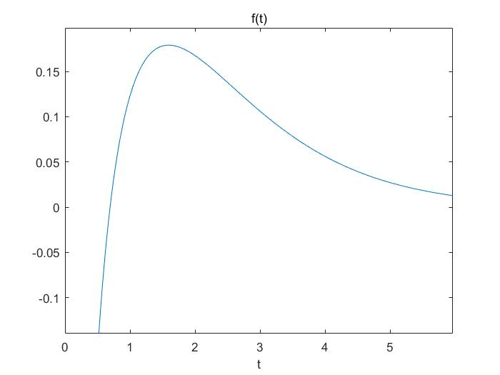
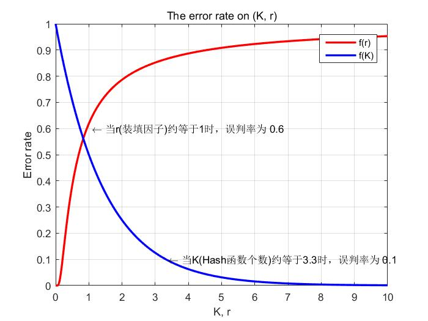

## Bit Set

[TOC]

In this part, we will focus on the bit set related algorithm, such as **sort of big data**, **search of big data**, **remove duplicate of big data**, **bloom filter**, etc.  
Bit set 可以被视为集合[Set](https://en.wikipedia.org/wiki/Set_(abstract_data_type))这种数据结构， 但是二者之间的主要差异是Bit set 一般仅仅用一个或者几个bit来表示一个元素, 而Set需要存储元素本身。

### Sort/Search/Remove duplicates using bitset

---

1. Sort: 使用 bit set 数据结构对数据进行排序，假设所有的数据不会重复；  
2. Search: 使用 bit set 实现一个set数据结构，从而进行检测数据是否在集合当中；  
3. Remove duplicates: 使用 bit set 实现一个set数据结构，从而对数据进行去重；  
   以上三种应用的方式都非常类似，以下仅仅以sort为例进行说明。

#### Problem description

给定一组不含重复元素的数据(数据的数量非常多, 难以放入内存)以及其**范围**，给出其排列后的结果(**排序问题**)。  
eg.  
	input   :  {${1, 3, 2, 5}$}, $10$
	output :  {${1,2,3,5}$}

#### Algorithm description and certification

假设输入为： $arr[n]$, ${arr[n]}\leq{N}$那么可以有如下算法：

  ```cpp
  // 1. Create the bit set data structure
  bitset<N> flag;
  for i = 0 ~ n:
    flag[arr[i]] = 1;
  for i = 0 ~ N:
    if flag[i] == 1:
      // this is the result after sort, it is nearly the same with the radix sort
      res.push_back(i);
  ```

#### Code

```cpp
void Sort(std::vector<uint32_t> *src) {
  // Create the bit set data structure
  const uint32_t N = 10;
  std::bitset<N> flag;
  for (std::size_t i = 0; i < src->size(); i++)
  {
    flag.set(i);
  }

  // Get the sorted result
  uint32_t cur_index = 0;
  for (std::size_t i = 0; i < N; i++)
  {
    if (flag.test(i))
    {
      (*src)[cur_index++] = i;
    }
  }
}

```

#### Reference

[Bitmap in big data](https://www.cnblogs.com/yangjiannr/p/da-shu-ju-chu-libitmap.html)

### Bloom filter

---

Bloom filter与 Bit set非常类似，其一般被用于判断某个元素是否存在与某个集合当中。与Bit Set 不同的是，Bloom filter需要用多个比特来表示一个元素是否存在(多个元素也可以复用这些bit)。

#### Problem description

某些存储系统的设计中，会存在空查询缺陷：当查询一个**不存在的key**时，需要访问慢设备（由于cache并没有hit中，因此需要访问磁盘等），从而导致效率低下。　
1. 对于某些系统，Value 保存在磁盘中，访问磁盘需要花费大量时间，然而使用布隆过滤器可以快速判断某个Key对应的Value是否存在，从而直接将空查询直接忽略，因此可以避免很多不必要的磁盘IO操作。 
2. 在前端系统当中，如果经常发生空查询操作，那么会引起大量不必要的服务器请求。

#### Algorithm description and certification

* 算法
  1. 生成$K$个hash函数；
  2. 建立一个长度为$N$的bool变量型的数组$flag[N]$；
  3. 对于每一个key, 生成其对应于$K$个hash函数的hashcode;
  4. 对于每个生成hashcode $i$, 将$flag[i]$置为$true$;

```cpp
// １. 生成K个hash函数，每个函数能够独立地将key映射为一个整数
function<uint32_t(string)> hash[K];
bitset<N> flag; // 标志位清０

// 2. 插入所有的key
for (auto key : keys)
  for i = 0 ~ K:
    flag[hash[i](key)].set();

// 3. 查询是否存在
string key = "str need to search";
for i = 0 ~ K:
    if ! flag[hash[i](key)].test():
      return false; // failed the test
return true; // passed all the test
```

* 优缺点

1. 一个$key$仅仅由$K$个bit来表示，并且其他的元素还能**复用这些比特**，从而节省了空间；
2. **无法删除**一个$key$,因为多个元素复用了存储空间；
3. 对于false positive, 算法有**一定的误判概率**。即某个元素本来不在集合当中，但是在判断的时候返回的是存在于集合当中。

* False positive的概率推导与解释

| Varible   | Explanation                                               |
| :-------- | --------------------------------------------------------- |
| $K$       | 相互独立的hash函数个数                                    |
| $flag[N]$ | 长度为$N$的标志位数组                                     |
| $p(key)$  | 某key不在集合当中，但是Bloom filter认为其在集合当中的概率 |
| $n$       | 当前集合当中的元素个数                                    |
| $i$       | 一个随机数，并且满足$i\in[0, N)$;                         |

 $\because$ 当前已经将$n$个元素插入到$flag$数组当中（假设hash函数映射是完全随机的）：  
$$
p(flag[i]=0)=(1-\frac{1}{N})^{Kn}
$$
 $\therefore$ 若一个key不在集合当中，那么$hash(key)$可以看成是完全随机的下标，且有: $p(flag[i]=0)$由式(1)确定；  
$$
\begin{equation}
\begin{aligned}
p(key)&=(1-p(flag[hash(key)]=0))^{K}\\
&=(1-(1-\frac{1}{N})^{Kn})^{K}
\end{aligned}
\end{equation}
$$

$\therefore$ 当 $n,N\to\infty$，我们有：  
$$
\begin{equation}
\begin{aligned}
p(key)&=\lim\limits_{n,N\to\infty}(1-(1-\frac{1}{N})^{Kn})^{K}\\
&=\lim\limits_{n,N\to\infty}(1-(1+\frac{1}{-N})^{{-N}\times\frac{Kn}{-N}})^{K}\\
&\approx(1-e^\frac{-Kn}{N})^{K}
\end{aligned}
\end{equation}
$$
若我们规定： $r=\frac{n}{N}\in[0, 1.0]$，$K\in[1, 30]$；如下图所示，可以看出：

1. 随着**装填因子**$r$的上升，冲突的概率急剧上升；
2. 冲突的概率随着hash函数的个数$K$先减小，后上升。



* 最优hash函数个数$K$ 

  $\because$ $p(key)\approx(1-e^{{-K}\times{r}})^{K}$， 若我们设:
  $$
  {y = (1-e^{{-K}\times{r}})^{K}} \xlongequal{\quad\quad}{\ln{y}=K\times{\ln{(1-e^{{-K}\times{r}})}}}
  $$
  $\therefore$ 对上述等式两边求微分，可得：
  $$
  \frac{\Delta y}{y}={\Delta K}\times{\ln{(1-e^{{-K}\times{r}})}}+{\Delta K}\times\frac {K}{(1-e^{{-K}\times{r}})}\times{(-1)\times{e^{{-K}\times{r}}}}\times{(-r)}
  $$
  对上式进程整理可以得到：


$$
  y'=\frac {\Delta y} {\Delta K} = y \times({\ln{(1-e^{{-K}\times{r}})}} +\frac{{K}\times{r}\times{e^{{-K}\times{r}}}} {1-e^{{-K}\times{r}}})
$$
  当然，我们也可以直接用matlab等比较成熟的工具帮助我们进行求偏导，如下所示：

  ```matlab
  >> syms e K r;
  >> diff((1-e^(-K*r))^K, K)
  ans =
  log(1 - 1/e^(K*r))*(1 - 1/e^(K*r))^K + (K*r*log(e)*(1 - 1/e^(K*r))^(K - 1))/e^(K*r)
  ```

  $\because$ $y>0$, 那么若我们设：$t={K}\times{r}$, 那么有：
$$
  f(t) ={\ln{(1-e^{-t})}} +\frac{{t}\times{e^{{-t}}}} {1-e^{{-t}}}
$$
  求这个式子的**零点**比较难，因此我们借助于matlab绘制出$f(x)$的图像如下:

  

  可以看出，$f(x)$仅仅在区间$(0, 1]$有零点，故我们可以直接用matlab求出其零点如下：

  ```matlab
  >> x0 = fzero(@(t)log(1-exp(1).^(-t))+ t / (exp(1).^t - 1),[eps,10])
  x0 =
      0.6931
  ```

  $\therefore$ 当 $ K\times{r}=0.6931$时，此时误判的概率达到极小值。

  $\therefore$ 当我们每次都选用最优的hash函数个数时，其误判的概率与装填因子$r$，hash函数个数$K$之间的关系如下图所示：

  

  ```matlab
  % Code of the beyond figure.
  %% plot the two curve (error_rate vs (K, r))
  xmin = 0, ymin = 0, xmax = 10, ymax = 1;
  h1 = ezplot('(1-exp(1)^(-0.6931))^(0.6931/r)', [xmin, xmax]);
  set(h1,'Color','r','LineWidth',2)
  hold on;
  h2 = ezplot('(1-exp(1)^(-0.6931))^K', [xmin, xmax]);
  text(3.3, 0.1, ' \leftarrow 当K(Hash函数个数)约等于3.3时，误判率为 0.1'); % 添加注释
  text(1, 0.6, ' \leftarrow 当r(装填因子)约等于1时，误判率为 0.6'); % 添加注释
  set(h2,'Color','b','LineWidth',2); % 设置线宽，颜色
  axis([xmin xmax ymin ymax]); % 设置坐标轴范围
  title('The error rate on (K, r)'); % 标题
  legend('f(r)','f(K)'); % 设置图例
  xlabel('K, r');
  ylabel('Error rate');
  grid on; % 设置网格
  hold off;
  ```

  

  #### Code

  

  #### Reference

1. [布隆过滤器(Bloom Filter)详解](https://www.cnblogs.com/liyulong1982/p/6013002.html)
2. [Wikipedia: Bloom Filter](https://en.wikipedia.org/wiki/Bloom_filter)