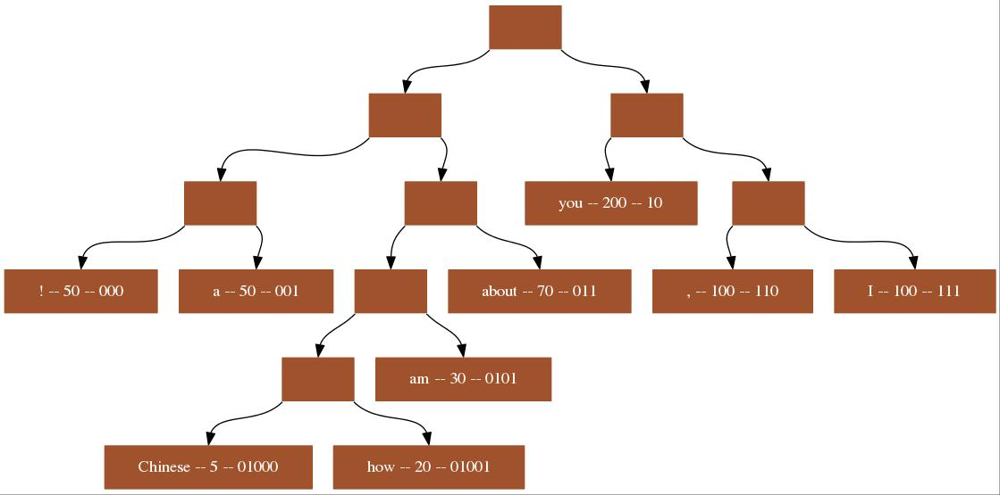

## Huffman Tree

[TOC]

------

In this part, we will focus on the huffman encoding algorithm which use the huffman tree to generate the encoding. As far as I know, the huffman tree is used in **lossless compression** and [Word2Vec](https://en.wikipedia.org/wiki/Word2vec) algorithm(use the huffman tree to reduce computational cost). 

### Huffman encoding

Huffman 编码是一种利用各个元素出现的频率不同而进行变长编码的编码方式。其主要原理为：对于出现频率高的元素，采用较短的编码；对于出现频率低的元素，采用较长的编码，从而**减小加权平均后编码长度**。

#### Problem description

假设一篇文档当中的符号集合为：$S=\{s_1, s_2, ...s_n\}$, 对于任意的符号$s_i\in{S}$, 其出现的频数为$w_i=weight(s_i)$; 那么可以有如下的优化问题：
$$
 {\mathop{argmin}_{c_i}} {\sum_{i=1}^n} length(c_i) \times {w_i}
$$
其中$c_i$为$s_i$所对应的编码；$length(c_i)$为符号$s_i$所对应的编码$c_i$的长度。上述公式的目的就是通过优化各符号的编码$c_i$, 从而使得整篇文档在存储时（必须还可以支持解码），所占空间最小。

以下图像展示了一个字符串集合的Huffman编码：以节点(you -- 200 -- 10)为例，其字符串为"you", 频数为200，编码为0b10；

<div center>



<\div>

#### Algorithm description and certification

假设输入为字符集合$s[n]$以及其权重$ｗ[n]$，那么可以有如下算法：

* Algorithm
  1. 对于$n$个字符，根据其权重$w$建立最小堆；

  2. 取出最小堆当中的两个最小元素，然后以二者权重之和构建新的节点(此节点的孩子分别为取出来的这两个最小元素)，并且加入到最小堆当中；

  3. 如果最小堆当中的元素个数大于１个，返回第二步；

  4. 以最小堆的最后一个元素为root对于生成的Huffman树进行层次遍历，以进行Huffman编码；

     由于每次从堆当中获取两个最小元素的时间复杂度为：$O(\log{n})$, 因此最终的时间复杂度为：$O(n\log{n})$; 当然，你也可以采用两个队列（一个用来存放Leaf node, 一个用于存放内部节点）来实现获取两个最小元素，此时的时间复杂度为：$O(n)+O(n\log{n})$, 后面的时间主要是与对$n$个元素进行排序。但是一般来讲，这种改进必要性不大，因为整个符号的个数一般是较小的，此外，还可能会涉及到排序。

* Cerification

  If you are interested in the proof of the this algorithm, you can refer to [here](http://www.cs.utoronto.ca/~brudno/csc373w09/huffman.pdf).

* Pseudocode

```cpp
assert(s.size != 0);
// 建立最小堆，每个节点包含：字符，权重，左孩子，右孩子, encoding
MinHeap min_heap(Node(NULL, NULL, s, w); 

// 建立Huffman树
while (min_heap.size >=2)
	Node min_0 = min_heap.pop(); // 获取并删除最小权重的节点
    Node min_1 = min_heap.pop();  
    // 建立以上述两个节点为孩子的新节点，其权重为上述两个节点之和，
    Node new_node = Node(&min_0, &min_1, "", min_0.w + min_1.w); 
    min_heap.push(new_node); // 加入到最小堆当中

// 利用广度优先搜索进行霍夫曼编码
Node root = min_heap.pop();
queue<Node> q;
q.push(root);
map<s, encoding>; // 建立一个map, key为字符，value为编码
while (q.not_empty)
	Node node = q.pop();
    if (node.left != NULL)
       node.left->encoding = "0" + node.encoding;
       q.push(node.left);          
    if (node.right != NULL)
       node.right->encoding = "1" + node.encoding;
       q.push(node.right);          
    if (node.left == NULL && node.right == NULL)
        // this is the leaf node, it cooresponding to a character s
        map[node.s] = node.encoding;

// 编码：运用上面建立的map即可轻松实现
// 解码：运用上述建立的Huffman tree即可轻松实现   
```


#### Code

For the below code, we used the data structure [heap](#heap.md) we defined before. So if you want to run this code, pls ensure you have the corresponding src code of the heap data structure.

```cpp

class Node {
 public:
  uint32_t node_id;  // we will use it to search this node
  uint32_t freq;     // the frequency of this word
  std::string val;
  Node* left;
  Node* right;

 public:
  Node(std::string word, uint32_t f, uint32_t id)
      : node_id(id), freq(f), val(word), left(nullptr), right(nullptr) {}
  Node() {}
  Node(const Node& other) {
    node_id = other.node_id;
    freq = other.freq;
    val = other.val;
    left = other.left;
    right = other.right;
  }
  bool operator<(const Node& other) const { return freq < other.freq; }
};

class HuffmanTree {
 public:
  Node* m_root;  // the huffman encoding tree
  std::unordered_map<std::string, uint32_t> m_input_freq;  // word and frequency
  std::unordered_map<std::string, std::string>　m_output_encoding;  // word and encoding

 public:
  HuffmanTree(std::unordered_map<std::string, uint32_t> input_freq);
  ~HuffmanTree() {
    // after we use this tree, we should delete this tree
    std::queue<Node*> q;
    if (m_root != nullptr) {
      q.push(m_root);
    }
    while (!q.empty()) {
      Node* node = q.front();
      q.pop();
      if (node->left != nullptr) {
        q.push(node->left);
      }
      if (node->right != nullptr) {
        q.push(node->right);
      }
      delete node;
    }
  }
 private:
  void DfsEncoding(
      Node* node,
      std::string encoding);  // use bfs to do encoding for the huffman tree
  std::string GetEncoding(std::string);
};

HuffmanTree::HuffmanTree(std::unordered_map<std::string, uint32_t> input_freq) {
  // special case
  if (input_freq.empty()) {
    return;
  }

  // Create the priority queue, node_id search table, using the input word,
  // frequency pairs
  // we didn't save the addr of the node in the heap, so we need this map to save those addr
  std::vector<Node*> node_id_table;
  Heap<Node> p_queue([](Node first, Node second) { return first < second; });
  uint32_t node_id = 0;
  for (auto pair : input_freq) {
    Node* ptr = new Node(pair.first, pair.second, node_id++);
    node_id_table.push_back(ptr);
    p_queue.Insert(*ptr);
  }

  // continue to merge those nodes until there is one node
  while (p_queue.Size() >= 2) {
    Node node1 = p_queue.Get();
    p_queue.Delete();
    Node node2 = p_queue.Get();
    p_queue.Delete();

    Node* ptr = new Node("", node1.freq + node2.freq, node1.node_id);
    ptr->left = node_id_table[node1.node_id];
    ptr->right = node_id_table[node2.node_id];
    p_queue.Insert(*ptr);               // Insert the new node into heap
    node_id_table[ptr->node_id] = ptr;  // update the node id table
  }
  m_root = node_id_table[p_queue.Get().node_id];  // update the root of the tree

  // Bfs encoding for the huffman tree
  DfsEncoding(m_root, ""); 
}
void HuffmanTree::DfsEncoding(Node* node, std::string encoding) {
  // not the leaf node
  if (node->left != nullptr) {
    DfsEncoding(node->left, encoding + "0");
  }
  if (node->right != nullptr) {
    DfsEncoding(node->right, encoding + "1");
  }

  // the leaf node
  if (node->left == nullptr && node->right == nullptr) {
    m_output_encoding.insert(std::make_pair(node->val, encoding));
    return;
  }
}
std::string HuffmanTree::GetEncoding(std::string str) {
  auto iter = m_output_encoding.find(str);
  if (iter != m_output_encoding.end()) {
    return iter->second;
  }
  return "";  // not a leaf node
}
```

#### Reference

[Proof of the huffman encoding algorithm](http://www.cs.utoronto.ca/~brudno/csc373w09/huffman.pdf)

Besides, you can refer to [Wikipedia](https://en.wikipedia.org/wiki/Huffman_coding), there are also some variation of the huffman algorithm. 