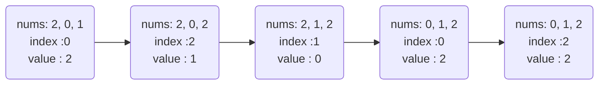

[TOC]

### Description

Given an unsorted integer array, find the smallest missing positive integer.

**Example 1:**

```
Input: [1,2,0]
Output: 3
```

**Example 2:**

```
Input: [3,4,-1,1]
Output: 2
```

**Example 3:**

```
Input: [7,8,9,11,12]
Output: 1
```

**Note:**

Your algorithm should run in *O*(*n*) time and uses constant extra space.


### Algorithm and certification

由题意可知，需要找 第一个缺失的正整数，并且要求空间复杂度为 *O(1)*。

设输入的数组为 *nums*，另外，为了简化边界的处理，不妨在输入数组中加入一个元素 0，此时的数组大小为 *n*；

对于任意的 $i \in [0, n)$，若 $nums[i] \in [0, n)$，那么将 $nums[i]$ 移动到位置 $i$ 上面，从而使得 $i=nums[i]$，最后仅仅需要一次线性扫描即可得到第一个缺失的正整数。

伪代码如下：

```cpp
// Initalize
nums.push_back(0); // avoid the empty corner case
n = nums.size();

// Move the element to right pos
for i = [0, n)
	value = nums[i]; // backup the value
	index = i;		 // backup the index
	while index != value && value >= 0 && value < n
		tmp = index[value];  // backup the value when index=value
		nums[value] = value;         
         index = value;		 // backup the index
         value = tmp;		 // backup the value

// Return the first positive value
for i = [0, n)
    if i != nums[i] 
    	return i;
return n; // when nums=[0,1,2], we should return 3
```

程序当中的第 6~13 行的作用是将元素移动到合适的位置上，假如 *nums = [2, 0, 1]*，那么当 $i = 1$ 时的元素移动方式如下图（以 while 循环这一行为例）：



### Code

```cpp
class Solution {
public:
    int firstMissingPositive(vector<int>& nums) {
        nums.push_back(0);
        uint32_t sz = nums.size();
        for (uint32_t i = 0; i < sz; i++)
        {
            uint32_t index = i;
            int32_t value = nums[i];
            while (index != value && value >= 0 && value < sz)
            {
                int new_value = nums[value];
                nums[value] = value;
                index = value;
                value = new_value;
            }
        }
        
        for (uint32_t i = 1; i < sz; i++)
        {
            if (nums[i] != i)
            {
                return i;
            }
        }
        return sz;
    }
};
```


### Reference

[Leetcode 41](https://leetcode.com/problems/first-missing-positive/description/)

